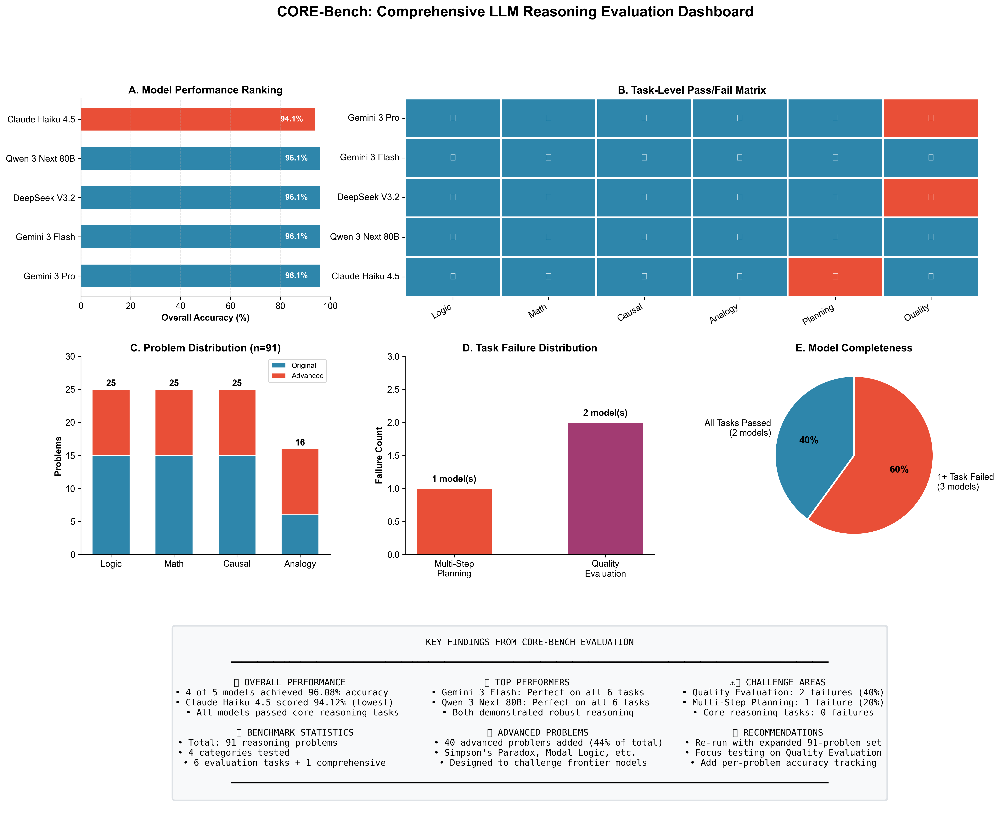

# 🧠 CORE-Bench: Comprehensive Ordered Reasoning Evaluation Benchmark

[](https://www.kaggle.com/benchmarks/taiwofeyijimi/core-bench)
[](https://opensource.org/licenses/MIT)
[](https://www.python.org/downloads/)

> **CORE-Bench** evaluates LLM reasoning across four dimensions: logical deduction, mathematical problem-solving, causal analysis, and analogical thinking. 91 curated problems assess systematic reasoning, fallacy avoidance, and structured thinking.

---

## 📊 Leaderboard Results (January 2026)

| Model | Score | Logic | Math | Causal | Analogy | Planning | Quality |
|-------|:-----:|:-----:|:----:|:------:|:-------:|:--------:|:-------:|
| **Gemini 3 Flash Preview** | **96.08%** | ✅ | ✅ | ✅ | ✅ | ✅ | ✅ |
| **Qwen 3 Next 80B** | **96.08%** | ✅ | ✅ | ✅ | ✅ | ✅ | ✅ |
| **Gemini 3 Pro Preview** | **96.08%** | ✅ | ✅ | ✅ | ✅ | ✅ | ❌ |
| **DeepSeek V3.2** | **96.08%** | ✅ | ✅ | ✅ | ✅ | ✅ | ❌ |
| **Claude Haiku 4.5** | **94.12%** | ✅ | ✅ | ✅ | ✅ | ❌ | ✅ |

---

## 🎯 Benchmark Overview

CORE-Bench rigorously evaluates LLM reasoning capabilities through structured, multi-dimensional testing across **91 problems** in 4 categories.

### Problem Distribution

| Category | Original | Advanced | Total | Key Concepts |
|----------|:--------:|:--------:|:-----:|--------------|
| **Logical Deduction** | 15 | 10 | 25 | Syllogisms, modal logic, quantifier scope |
| **Math Reasoning** | 15 | 10 | 25 | Optimization, probability, sequences |
| **Causal Reasoning** | 15 | 10 | 25 | Simpson's paradox, survivorship bias |
| **Analogical Reasoning** | 6 | 10 | 16 | Complex relationships, antonyms |

### Evaluation Tasks

| Task | Description | Difficulty |
|------|-------------|:----------:|
| Logical Deduction | Formal logic, syllogisms, fallacy detection | ⭐⭐ |
| Math Word Problems | Multi-step calculations, real-world context | ⭐⭐ |
| Causal Reasoning | Cause-effect, counterfactuals, confounding | ⭐⭐ |
| Analogical Reasoning | Pattern completion (A:B :: C:?) | ⭐⭐ |
| Multi-Step Planning | Constraint satisfaction (river crossing) | ⭐⭐⭐ |
| Quality Evaluation | Judge-based reasoning assessment | ⭐⭐⭐⭐ |

---

## 📁 Repository Structure

```
CORE-Bench/
├── reasoning_benchmark.ipynb              # Main benchmark (Kaggle compatible)
├── core_bench_publication_analysis.ipynb  # Analysis & visualization
├── leaderboard.json                       # Latest results data
├── publication_figures/                   # High-resolution figures
│   ├── png/                               # 300 DPI PNG images
│   ├── svg/                               # Vector graphics
│   └── pdf/                               # PDF for publications
├── README.md
└── LICENSE
```

---

## 🚀 Quick Start

### Run on Kaggle
Visit the [CORE-Bench on Kaggle](https://www.kaggle.com/benchmarks/taiwofeyijimi/core-bench) to evaluate models directly.

### Run Locally

```bash
# Clone the repository
git clone https://github.com/tiamole/CORE-Bench.git
cd CORE-Bench

# Install dependencies
pip install pandas numpy matplotlib seaborn

# Open the benchmark notebook
jupyter notebook reasoning_benchmark.ipynb
```

---

## 📈 Key Findings

1. **Two Perfect Performers**: Gemini 3 Flash and Qwen 3 Next 80B passed all 6 evaluation tasks
2. **Quality Evaluation Challenge**: 40% of models failed this meta-reasoning task
3. **Planning Differentiation**: Multi-step planning separated Claude Haiku from top performers
4. **Core Reasoning Mastery**: 100% pass rate on logical, math, causal, and analogical tasks

---

## 🔬 Advanced Problem Concepts

### Logical Deduction
- Biconditional reasoning
- Nested conditionals
- Constructive/destructive dilemmas
- Sorites chains
- Modal logic

### Mathematical Reasoning  
- Optimization problems
- Probability calculations
- Exponential growth
- Permutations/combinations
- Logarithmic operations

### Causal Reasoning
- Simpson's paradox
- Survivorship bias
- Berkson's paradox
- Instrumental variables
- Ecological fallacy

### Analogical Reasoning
- Complex relationship mappings
- Multi-attribute analogies
- Antonym pairs
- Process analogies

---

## 📊 Visualization



---

## 📜 Citation

```bibtex
@misc{core-bench-2026,
  author = {Taiwo Feyijimi},
  title = {CORE-Bench: Comprehensive Ordered Reasoning Evaluation Benchmark},
  year = {2026},
  publisher = {Kaggle Benchmarks},
  url = {https://www.kaggle.com/benchmarks/taiwofeyijimi/core-bench}
}
```

---

## 🤝 Contributing

Contributions welcome! Areas for improvement:

- **Add Problems**: Submit challenging reasoning problems via pull request
- **New Categories**: Spatial reasoning, temporal reasoning, common sense
- **Harder Variants**: Multi-hop reasoning, adversarial examples

### Problem Submission Format

```python
{
    "premises": "Your premises here",
    "question": "Your question here", 
    "answer": "expected_answer",
    "reasoning_type": "category_label"
}
```

---

## 📄 License

MIT License - see [LICENSE](LICENSE) for details.

---

<p align="center">
  <strong>Built for the AI reasoning research community</strong>
</p>
